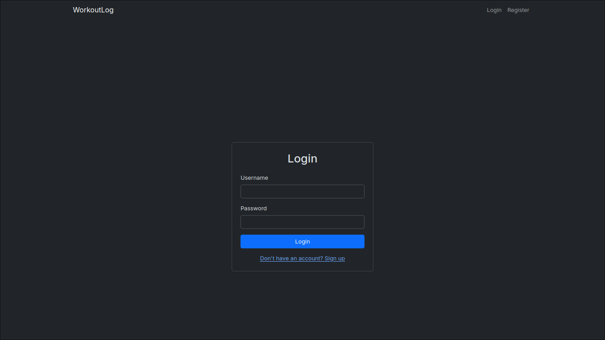
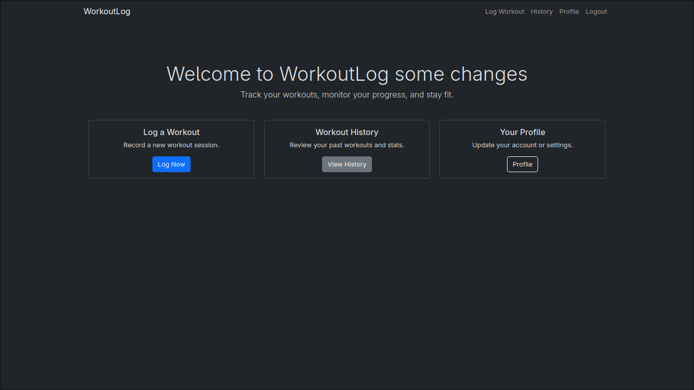
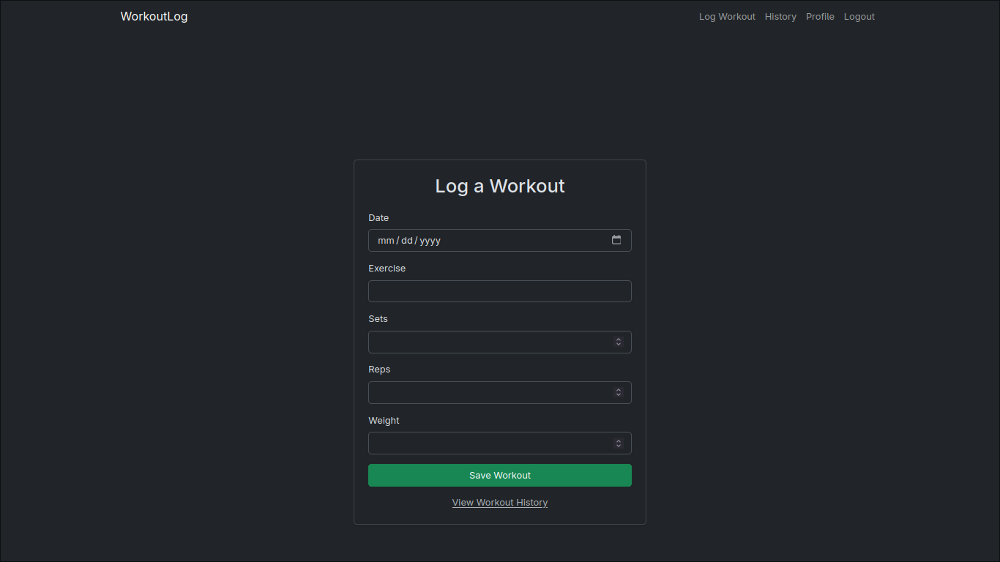

# 🏋️‍♂️ Workout Tracker

A simple Django web app to log, manage, and review your workouts. Built with user-friendly features like account management, workout history, and a clean Bootstrap-powered interface.

---

## ✨ Features

- 👤 User Authentication (Register, Login, Logout)
- 🗓️ Log Workouts 
- 📖 Workout History View
- ✏️ Edit & 🗑️ Delete Workouts
- 🙋 Profile with account settings
- 📱 Mobile-friendly UI with Bootstrap

---

## 📸 Screenshots

| Login Page | Dashboard | Workout Log |
|------------|-----------|-------------|
|  |  |  |

---

## 🚀 Getting Started

### 🔧 Prerequisites

- Python 3.13+
- Docker (optional, recommended)
- PostgreSQL

---

### 💻 Local Setup (without Docker)

```bash
git clone https://github.com/ShivangSrivastava/workout-tracker.git
cd workout-tracker
python -m venv .venv
source .venv/bin/activate
pip install -r requirements.txt
python manage.py migrate
python manage.py createsuperuser  
python manage.py runserver
````

Access: [http://127.0.0.1:8000/](http://127.0.0.1:8000/)

---

### 🐳 Docker Setup

1. Ensure Docker & Docker Compose are installed.
2. Add `.env` with database credentials (if using PostgreSQL).
3. Start containers:

```bash
docker-compose up --build
```

---

## 🗃️ Folder Structure

```plaintext
workoutlog/
├── accounts/           # User auth
├── tracker/            # Workout logic
├── templates/          # HTML templates
├── db.sqlite3          # Default database
├── Dockerfile
├── compose.yml
└── README.md
```

---

## 🔒 Environment Variables

Create a `.env` file in the root:

```env
DEBUG=True
SECRET_KEY="secret-key"
ALLOWED_HOSTS=127.0.0.1,localhost,web

# PostgreSQL DB
DB_NAME=workout_db
DB_USER=username
DB_PASSWORD=password
DB_HOST=db
DB_PORT=5432
```

---

## 🔮 Future Improvements

* 📊 Workout analytics (charts, progress)
* 📆 Calendar view for workouts
* 🧠 AI workout suggestions (basic rule-based)
* 🔔 Email reminders
* 🌍 Deploy to Render / Railway / Vercel


---

## 🙋 Author

Made by [Shivang Srivastava](https://github.com/ShivangSrivastava)
